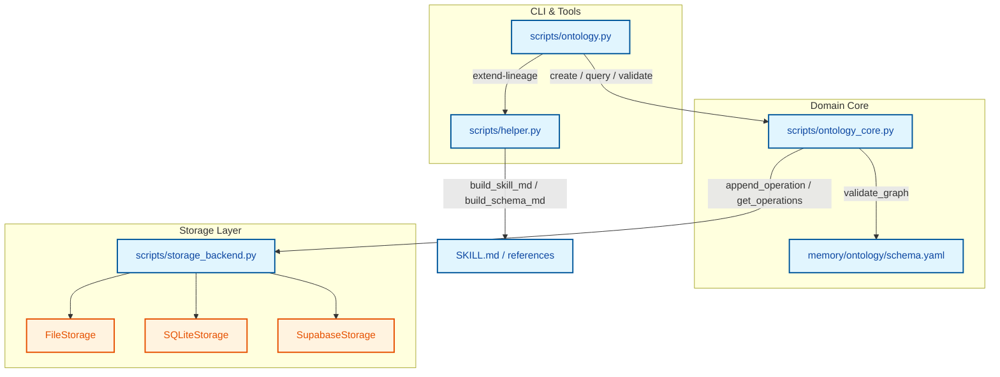

# data-lineage-ontology

基于原 ontology skill（GitHub `openclaw/skills`）演进的通用知识图谱与血缘图谱内核，保留原有：

- CLI 使用方式（`scripts/ontology.py`）
- append-only operation log 设计
- Entity / Relation 领域模型

并在此基础上引入：

- 统一的存储抽象（`BaseStorage` + File / SQLite / Supabase drivers）
- 基于 YAML schema 的运行时校验（`validate_graph`）
- helper 驱动的 SKILL / 文档自动生成与扩展（`scripts/helper.py` + `extend-lineage`）

本仓库既可以作为独立的“结构化记忆 + 血缘”组件使用，也可以作为大模型技能（Skill）的一部分，对外暴露稳定的 CLI 与文档协议。

---

## 核心概念与架构

- **Entity**
  - 结构：`{ id, type, properties, created, updated }`
  - 由 YAML schema 中的 `types` 段驱动字段含义与约束。

- **Relation**
  - 结构：`{ from_id, type, to_id, properties }`
  - 与 YAML schema 中 `relations` 段的 key 对齐，例如 `has_task` / `depends_on` / `has_column` 等。

- **Operation Log（Append-Only）**
  - 所有变更都会被转换为标准化 op 记录：
    - `create` / `update` / `delete` / `relate` / `unrelate`
  - 抽象接口：`BaseStorage.append_operation(op)` / `BaseStorage.get_operations()`
  - 通过 `load_graph` 回放 op 序列，重建当前实体与关系视图。

- **分层结构**
  - 领域层：`Entity` / `Relation` 定义图中的点和边；
  - 适配层：`entity_to_create_op` / `relation_to_relate_op` 等函数，负责领域对象 ↔ op 的映射；
  - 存储层：`FileStorage` / `SQLiteStorage` / `SupabaseStorage` / `SupabaseStorageRest` 只关心 op 的持久化；
  - Skill & 文档层：`scripts/ontology.py` + `scripts/helper.py` + `SKILL.md` + `references/*`。

相关设计细节可以参考：

- [重构ontology项目.md](file:///d:/PycharmProjects/data-lineage-ontology/%E9%87%8D%E6%9E%84ontology%E9%A1%B9%E7%9B%AE.md)
- [迭代日志.md](file:///d:/PycharmProjects/data-lineage-ontology/%E8%BF%AD%E4%BB%A3%E6%97%A5%E5%BF%97.md)

---

## 核心脚本与模块

- `scripts/ontology_core.py`
  - 领域与存储无关的核心逻辑：
    - `create_entity` / `get_entity` / `update_entity` / `delete_entity`
    - `create_relation` / `delete_relation` / `get_related`
    - `list_entities` / `query_entities`
    - `load_graph` / `validate_graph`
  - 通过环境变量选择存储后端：
    - `KG_BACKEND=file`（默认）：追加写 `memory/ontology/graph.jsonl`
    - `KG_BACKEND=sqlite`：使用 SQLite，`KG_DB_PATH=memory/ontology/kg.db`
    - `KG_BACKEND=supabase` / `KG_BACKEND=supabase_rest`：使用 Supabase（需要配置 `SUPABASE_URL` / `SUPABASE_KEY`）

- `scripts/storage_backend.py`
  - 定义 `BaseStorage` 抽象与具体实现：
    - `FileStorage`
    - `SQLiteStorage`
    - `SupabaseStorage`
    - `SupabaseStorageRest`
  - 只负责 op 的读写，不直接关心实体/关系结构和业务含义。

- `scripts/ontology.py`
  - 面向终端 / 调用方的 CLI 入口，封装 `ontology_core` 的主要操作：
    - `create` / `get` / `update` / `delete`
    - `list` / `query`
    - `relate` / `unrelate` / `related`
    - `validate`
    - `schema-append`（附加/合并 schema 片段）
    - `extend-lineage`（应用扩展 schema 并重建 SKILL / 文档）

- `scripts/helper.py`
  - 从默认模板 + schema 生成对外文档：
    - `build_skill_md(default_skill, schema.yaml, SKILL.md, ext_schema)`
    - `build_schema_md(default_schema.md, ext_schema, references/schema.md)`
    - `build_queries_md(default_queries.md, ext_schema, references/queries.md)`
  - 关键行为：
    - 基于 `schema.yaml` 与扩展 `ext_schema`（如 `references/lineage/schema-append.yaml`）自动生成扩展能力描述，并追加到 `SKILL.md` 的 `description` 中；
    - 为 SKILL.md 末尾生成 `## Extensions` 索引小节，引导读取 `references/schema.md` / `references/queries.md` 中的扩展详情；
    - 生成文档时清理所有 helper 技术标记，确保最终对外的 `SKILL.md` / `schema.md` / `queries.md` 都是「干净」的普通 Markdown。

---

## 运行与使用

### 基础运行环境

- Python 3.10+（推荐）
- 不依赖特殊框架，主要使用：
  - 标准库（`json` / `pathlib` / `sqlite3` / `datetime` 等）
  - `PyYAML`（`yaml.safe_load` / `yaml.safe_dump`）

> 仓库本身不自动安装依赖，请根据自己的环境管理方式（如 `pip` / `poetry` / `conda`）手动安装所需包。

### 1. 创建 / 查询实体与关系（基于 CLI）

在项目根目录下：

```bash
# 创建实体
python scripts/ontology.py create --type Person --props '{"name": "Alice"}'

# 列出所有 Person
python scripts/ontology.py list --type Person

# 按条件查询
python scripts/ontology.py query --type Task --where '{"status": "open"}'

# 创建关系
python scripts/ontology.py relate --from proj_001 --rel has_task --to task_001

# 查看关联
python scripts/ontology.py related --id proj_001 --rel has_task --dir outgoing

# 校验图谱
python scripts/ontology.py validate
```

默认使用 FileStorage，将 op 追加写入 `memory/ontology/graph.jsonl`，并基于 `memory/ontology/schema.yaml` 做校验。

### 2. 切换存储后端（File / SQLite）

- File 后端（默认）：

  ```bash
  set KG_BACKEND=file  # Windows PowerShell 可用 $env:KG_BACKEND="file"
  ```

- SQLite 后端：

  ```bash
  set KG_BACKEND=sqlite
  set KG_DB_PATH=memory/ontology/kg.db
  ```

  使用 SQLite 时，op 会落到 `KG_DB_PATH` 对应的数据库中，但 CLI 调用方式保持不变。

Supabase 后端需要额外的环境变量与实例配置，具体可参考 `scripts/storage_backend.py` 中的实现。

### 3. 维护 schema 与扩展

- 运行时 schema：`memory/ontology/schema.yaml`
  - 通过 `validate` 命令加载，用于约束实体与关系。

- 追加/合并 schema 片段：

  ```bash
  python scripts/ontology.py schema-append --schema memory/ontology/schema.yaml --file path/to/fragment.yaml
  ```

- 以血缘扩展为例（`references/lineage/schema-append.yaml`）：
  - 定义了 `Table` / `Column` / `Metric` / `Dimension` 等扩展类型；
  - 定义了 `has_column` / `depends_on` / `derives_from` / `references_dimension` 等扩展关系（其中部分声明 `acyclic: true` 用于环路校验）。

### 4. 通过 extend-lineage 更新 SKILL 与文档

`extend-lineage` 命令负责把扩展 schema 引入运行时，并重建相关文档：

```bash
python scripts/ontology.py extend-lineage --config references/lineage/schema-append.yaml
```

- 行为概览：
  - 将扩展配置合入 `memory/ontology/schema.yaml`；
  - 重新生成：
    - `SKILL.md`：在 `description` 中追加扩展能力描述，并在文末 `## Extensions` 中引导至 schema / queries 文档；
    - `references/schema.md`：在 `Extension types` / `Extension relations` 小节中渲染扩展类型与关系的完整结构；
    - `references/queries.md`：若扩展中提供 `queries` 列表，则生成对应的「Extension Queries」小节。

这样可以确保：

- 扩展能力只在一份 schema/extension YAML 中维护；
- SKILL 与文档始终与实际运行时 schema 保持同步；
- 对大模型暴露的是既简洁又信息密度足够的入口文档。

---

## 测试与验证

项目当前主要通过直接调用 `ontology_core` 与 CLI 进行自测，包含：

- FileStorage 与 SQLiteStorage 两种后端下：
  - 实体的创建 / 查询 / 更新 / 删除；
  - 关系的创建 / 查询（出边 / 入边）/ 取消；
  - `validate_graph` 在运行时 schema 下的校验结果（应返回空错误列表或具体错误信息）。

具体的测试流程与结论记录在：

- [迭代日志.md](file:///d:/PycharmProjects/data-lineage-ontology/%E8%BF%AD%E4%BB%A3%E6%97%A5%E5%BF%97.md)

后续如果需要，可以基于现有 CLI 封装更系统化的自动化测试。

---

## 在 LLM 系统中挂载 ontology Skill

下面是一个与具体框架无关的挂载思路，可以映射到 OpenAI Tooling、LangChain Tools、自己写的 Agent Runtime 等。

### 1. 准备 Skill 描述与文档

- 保持 `SKILL.md` 与 `references/*` 最新：
  - 修改基础 schema 后，运行：  
    `python scripts/ontology.py schema-append ...`
  - 应用扩展（例如血缘）：  
    `python scripts/ontology.py extend-lineage --config references/lineage/schema-append.yaml`
- 在 LLM 系统中，将 `SKILL.md` 作为该 skill 的**主描述文件**：
  - `name: ontology` 用作 skill 唯一标识；
  - `description`（含扩展描述）用于让大模型理解功能边界；
  - 正文中的「Core Types / Storage / When to Use / Extensions / References」为额外背景知识。

大多数「基于文档注册技能」的系统，都可以直接把 `SKILL.md` 挂到某个 skill / tool 的说明上。

### 2. 暴露 CLI 作为 Tool / Action

ontology 的对外面是 CLI：`python scripts/ontology.py <command> ...`。在 LLM 系统里通常有两种映射方式：

- **细粒度工具映射**（推荐）
  - 为几个典型操作分别注册工具：
    - `ontology_create_entity` → 调用 `python scripts/ontology.py create ...`
    - `ontology_query_entities` → 调用 `python scripts/ontology.py query ...`
    - `ontology_relate` / `ontology_unrelate` → 调用 `relate` / `unrelate`
    - `ontology_related` → 调用 `related`
    - `ontology_validate` → 调用 `validate`
  - 在工具 schema 中，将 CLI 参数暴露为结构化入参（例如 `type`, `props`, `where` 等），由运行时负责拼 CLI 命令并执行。

- **单一网关工具映射**（快速集成）
  - 暴露一个通用工具，例如 `ontology_cli`：
    - 入参包含：`command`（如 `"create"`）、`args`（例如 JSON 对象，内部再映射为 `--type` / `--props`等）。
    - 工具实现侧把 `command` + `args` 转为具体 CLI 调用。
  - 优点：扩展新子命令时无需改 LLM schema；缺点：对大模型不如细粒度工具直观。

无论哪种方式，核心是：**LLM 永远只看高层的工具描述，真正的实现逻辑下沉到 `scripts/ontology.py`**，这样可以复用我们已经调好的 CLI 行为与校验逻辑。

### 3. 统一工作目录与存储配置

- 运行 LLM 进程时，确保当前工作目录（`cwd`）为本仓库根目录，或者在调用工具时显式指定：
  - `python d:/PycharmProjects/data-lineage-ontology/scripts/ontology.py ...`
- 配置环境变量决定存储后端：
  - File（默认）：`KG_BACKEND=file`
  - SQLite：`KG_BACKEND=sqlite`，`KG_DB_PATH=memory/ontology/kg.db`
  - Supabase：`KG_BACKEND=supabase` / `supabase_rest`，并设置 `SUPABASE_URL` / `SUPABASE_KEY`
- 确保 LLM 运行时对以下路径有读写权限：
  - `memory/ontology/graph.jsonl`
  - `memory/ontology/schema.yaml`
  - `memory/ontology/*.db`

在多 Agent / 多技能系统中，只要这些文件路径对不同组件是共享的，就可以把 ontology 当成「全局结构化记忆」来用。

### 4. 触发策略与与其他技能协作

- 触发策略可以直接沿用 `SKILL.md` 中的「When to Use」表格，把这些触发条件映射到上游的路由逻辑：
  - 例如在 Router 中，当用户提到「记住」「link X to Y」「依赖关系」「血缘」「表字段」时，把请求路由到 ontology skill。
- 与其他技能协作的一般模式：
  - 其他技能负责业务侧操作（如执行 ETL、跑 SQL、调用外部 API）；
  - ontology skill 负责把这些操作的结果编码成实体与关系，落入 `graph.jsonl` / SQLite / Supabase，并在后续对话中提供查询与依赖分析能力。

这样，LLM 系统中的其他工具可以只管「调用」、不关心底层图谱实现，而 ontology skill 则负责把所有状态维持在统一的、有 schema 约束的知识图谱里。


## 5. Visual Overview (Code & Logic Map)


## 6. Detailed Change Analysis

### 核心引擎 (`ontology_core.py`)
*   **What Changed:** 定义了 `Entity` 和 `Relation` 的核心数据结构，实现了图谱对象的生命周期管理逻辑。通过 `load_graph` 方法回放操作日志以重建当前的图谱视图，并提供 `validate_graph` 方法对图谱数据进行深度校验（包含必填项、枚举、以及 `acyclic` 防环等约束）。

### 存储适配层 (`storage_backend.py`)
*   **What Changed:** 引入了 `BaseStorage` 抽象接口，彻底解耦了图谱的领域逻辑与底层存储机制。

| Storage Engine | Class Name | Description |
| :--- | :--- | :--- |
| **Local File** | `FileStorage` | 默认后端，将图谱变更操作以 JSONL 格式追加写入本地文件。 |
| **SQLite** | `SQLiteStorage` | 本地关系型数据库支持，零依赖，适合处理更大数据量。 |
| **Supabase SDK** | `SupabaseStorage` | 基于 Supabase 官方 SDK 的云端存储实现。 |
| **Supabase REST** | `SupabaseStorageRest` | 基于纯 `httpx` 调用的云端存储，无官方 SDK 依赖，更轻量。 |

### 命令行接口 (`ontology.py`)
*   **What Changed:** 提供了统一的命令行操作入口，既面向终端开发者，也可直接作为 LLM Tool / Agent Action 供大模型调用。

| Command | Arguments | Description |
| :--- | :--- | :--- |
| `create` / `update` / `delete` | `--type`, `--props`, `--id` | 实体生命周期管理（增删改）。 |
| `relate` / `unrelate` | `--from`, `--rel`, `--to` | 创建或解除实体间的边（关系）。 |
| `query` / `related` | `--type`, `--where`, `--id` | 图谱条件查询与上下游关联节点遍历。 |
| `validate` | `--graph`, `--schema` | 基于当前的 Schema 规则对图谱进行完整性校验。 |
| `extend-lineage` | `--config` | 将血缘扩展 Schema 注入当前环境并重新生成文档。 |

### 自动文档与血缘扩展 (`helper.py` & `references/*`)
*   **What Changed:** 
    *   新增自动化脚本 `helper.py`，它会读取默认 Markdown 模板和当前的 YAML Schema，动态组装出提供给大模型读取的 `SKILL.md` 和详细参考文档，确保文档与代码校验规则始终保持同步。
    *   新增 Data Lineage（数据血缘）扩展，预置了 `Table`, `Column`, `Metric`, `Dimension` 实体类型，以及具备防环特性的 `depends_on`, `derives_from` 关系。
